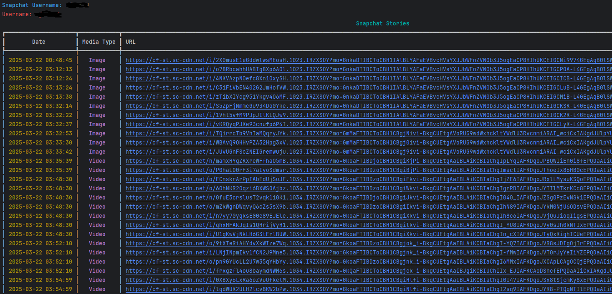

# Snapchat-Scraper | مستخرج قصص سناب شات

📸 **Project Description | وصف المشروع:**  
 

 Snapchat-Scraper is a Python-based tool designed to fetch and display public Snapchat stories. The tool allows users to retrieve media content (images and videos) along with timestamps from publicly available Snapchat stories, without affecting privacy or accessing private stories.
سناب شات سكرابر هو أداة مبنية بلغة بايثون مصممة لجلب وعرض القصص العامة في سناب شات. تتيح الأداة للمستخدمين استرجاع محتوى الوسائط (صور وفيديوهات) مع التاريخ الزمني من الستوريات العامة المتاحة على سناب شات فقط، دون التأثير على الخصوصية أو الوصول إلى القصص الخاصة.  
---  
---

## 🚀 **Installation Steps | خطوات التثبيت:**

### 1. **Clone the Repository | استنساخ المستودع:**
```bash
git clone https://github.com/m9ebah/Snapchat-Scraper.git
```

### 2. **Navigate to the Directory | الانتقال إلى المجلد:**
```bash
cd Snapchat-Scraper
```

### 3. **Install Required Libraries | تثبيت المكتبات المطلوبة:**
```bash
pip install -r requirements.txt
```

---

## ⚙️ **How to Run the Project | كيفية تشغيل المشروع:**

### 1. **Run the Script | تشغيل السكربت:**
```bash
python snapchat_scraper.py
```

### 2. **Enter the Snapchat Username | إدخال اسم المستخدم:**  
When you run the script, you will be prompted to enter the Snapchat username:  
عند تشغيل السكربت، سيُطلب منك إدخال اسم مستخدم سناب شات:
```
Snapchat Username: example_username
```

---

## 💾 **Libraries Used | المكتبات المستخدمة:**

- `requests`
- `rich` 

---

## 📸 **Output Example | مثال على المخرجات:**



---

## 🤝 **Contribution | المساهمة:**

We welcome all contributions to improve the project. You can open an Issue or submit a Pull Request.  
نرحب بجميع المساهمات لتحسين المشروع. يمكنك فتح مشكلة (Issue) أو إرسال طلب سحب (Pull Request).

